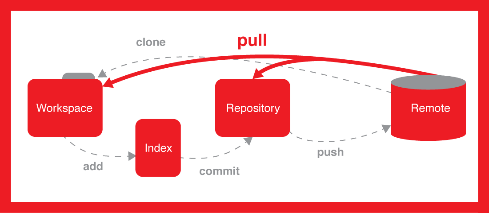

# Ethereum project manual
Ethereum project manual: Git, Node, Solidity...

## Table of contents
* [Prerequisites](#prerequisites)
* [Using Git/GitHub](#using-gitgithub)
* [Using Node/npm](#using-nodenpm)
* [Start a new project](#start-a-new-project)
* [Work with an existing project](#work-with-an-existing-project)
  
## Prerequisites
* __Git__
  * [Git for Windows](https://git-scm.com/download/win)
  * Git for Linux:
  ```
  $ sudo apt-get install git
  ```
  * or [GitHub Desktop](https://desktop.github.com/)
* __Node.js & npm__
  * [Node 8 for Windows](https://nodejs.org/dist/v8.9.1/node-v8.9.1-x64.msi)
  * Node 8 for Linux:
  ```
  $ curl -sL https://deb.nodesource.com/setup_8.x | sudo -E bash -
  $ sudo apt-get install -y build-essential
  $ sudo apt-get install -y nodejs
  ```
  * Execute once to install Web3, __only in Windows__, as administrator:
  ```
  $ npm install --global --production windows-build-tools 
  ```
* __Visual Studio Code__
  * [Visual Studio Code for Windows/Linux/Mac](https://code.visualstudio.com/Download)
  * [Ethereum Solidity Language plugin for Visual Studio Code](https://marketplace.visualstudio.com/items?itemName=JuanBlanco.solidity)

## Using Git/GitHub

### Git workflow


### Git commands
| Command                             | Description                                           |
| ------------------------------------|-------------------------------------------------------|
| `git init`                          | Creates a new local repository                        |
| `git clone <url>`                   | Downloads a project and its entire version history    |
| `git status`                        | Lists all new or modified files to be commited        |
| `git diff [filename]`               | Shows file differences not yet staged                 |
| `git add [-u] [filename|.|pattern]` | Snapshots the file in preparation for versioning      |
| `git commit [-m "message"]`         | Records file snapshots permanently in version history |
| `git push origin master`            | Uploads all local branch commits to GitHub            |
| `git pull origin master`            | Downloads bookmark history and incorporates changes   |

## Using Node/npm
...

## Start a new project
...

## Work with an existing project
...
